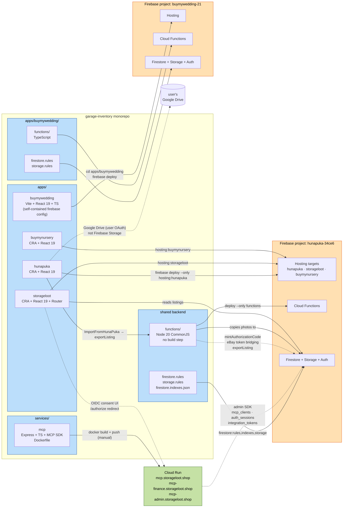

# Repo assets and deploy topology

Apps, services, shared backend code, and where each piece ships to.

Solid arrows are deploys; dotted arrows are runtime data flow.

```mermaid
flowchart LR
    subgraph Repo["garage-inventory monorepo"]
        direction TB
        subgraph Apps["apps/"]
            HUN["hunapuka<br/>CRA + React 19"]
            SL["storageloot<br/>CRA + React 19 + Router"]
            BMN["buymynursery<br/>CRA + React 19"]
            BMW["buymywedding<br/>Vite + React 19 + TS<br/>(self-contained firebase config)"]
        end
        subgraph Shared["shared backend"]
            FN["functions/<br/>Node 20 CommonJS<br/>no build step"]
            RULES["firestore.rules<br/>storage.rules<br/>firestore.indexes.json"]
        end
        subgraph Svc["services/"]
            MCP["mcp<br/>Express + TS + MCP SDK<br/>Dockerfile"]
        end
        subgraph BMWFN["apps/buymywedding/"]
            BMW_FN["functions/<br/>TypeScript"]
            BMW_RULES["firestore.rules<br/>storage.rules"]
        end
    end

    subgraph FB1["Firebase project: hunapuka-34ce6"]
        H_HOSTING["Hosting targets<br/>hunapuka · storageloot · buymynursery"]
        H_FN["Cloud Functions"]
        H_FS["Firestore + Storage + Auth"]
    end

    subgraph FB2["Firebase project: buymywedding-21"]
        W_HOSTING["Hosting"]
        W_FN["Cloud Functions"]
        W_FS["Firestore + Storage + Auth"]
    end

    CR["Cloud Run<br/>mcp.storageloot.shop<br/>mcp-finance.storageloot.shop<br/>mcp-admin.storageloot.shop"]

    HUN -- "firebase deploy --only hosting:hunapuka" --> H_HOSTING
    SL  -- "hosting:storageloot" --> H_HOSTING
    BMN -- "hosting:buymynursery" --> H_HOSTING
    FN  -- "deploy --only functions" --> H_FN
    RULES -- "firestore:rules,indexes,storage" --> H_FS

    BMW -- "cd apps/buymywedding<br/>firebase deploy" --> W_HOSTING
    BMW_FN  --> W_FN
    BMW_RULES --> W_FS

    MCP -- "docker build + push (manual)" --> CR

    SL  -. "OIDC consent UI<br/>/authorize redirect" .-> CR
    CR  -. "admin SDK<br/>mcp_clients · auth_sessions<br/>integration_tokens" .-> H_FS
    FN  -. "mintAuthorizationCode<br/>eBay token bridging<br/>exportListing" .-> H_FS
    HUN -. "Google Drive (user OAuth)<br/>not Firebase Storage" .-> Drive[("user's<br/>Google Drive")]
    HUN -- "ImportFromHunaPuka → exportListing" --> FN
    FN  -- "copies photos to" --> H_FS
    SL  -- "reads listings" --> H_FS

    classDef fb fill:#FFE0B2,stroke:#E65100,color:#000
    classDef cr fill:#C5E1A5,stroke:#33691E,color:#000
    classDef repo fill:#BBDEFB,stroke:#0D47A1,color:#000
    class FB1,FB2 fb
    class CR cr
    class Apps,Shared,Svc,BMWFN repo
```
